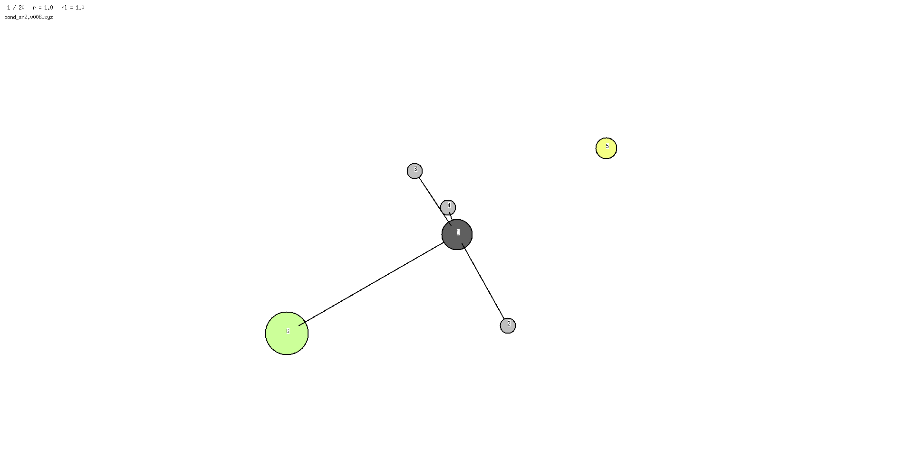
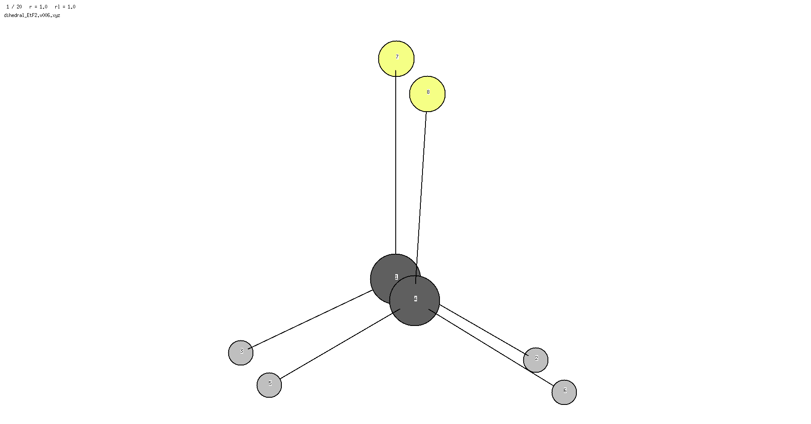
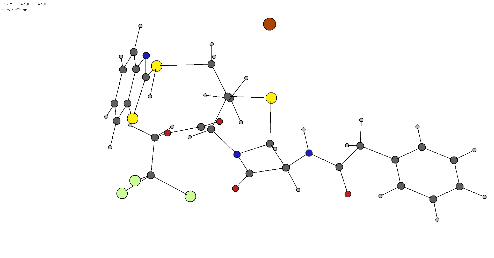
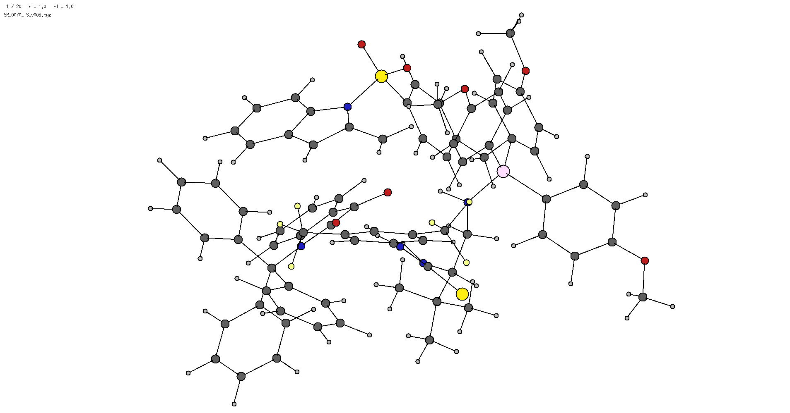

# A command line and python package to read in vibrational trajectories and return the internal coordinates associated with the vibration.

## Installation
For now can be installed locally by:
- ```git clone https://github.com/aligfellow/vib_analysis.git```
- ```cd vib_analysis```
- ```pip install .```

## Usage
- Requires a ```*trj.xyz``` file
  - of the structure:
```
[n_atoms]
comment line
<atomic symbol/number> <x> <y> <z>
... ... ... ... 
```
- Currently, this has been written for orca.out
  - _e.g._ ```orca_pltvib <orca>.out 6 ```# first vibrational mode
  - this could also come from using [pyQRC](https://github.com/patonlab/pyQRC) from R. Paton
  
     - could run a loop of amplitudes to generate individual xyz trj files **to do**
     
In the future this may be able to read orca.out and gaussian.log files directly, rather than requiring a trj.xyz file.

## Command line interface
```
vib_analysis -h
usage: vib_analysis [-h] [--bond_tolerance BOND_TOLERANCE] [--angle_tolerance ANGLE_TOLERANCE]
                    [--dihedral_tolerance DIHEDRAL_TOLERANCE] [--bond_threshold BOND_THRESHOLD]
                    [--angle_threshold ANGLE_THRESHOLD] [--all]
                    xyz_file

Internal Coordinate Displacement Analyzer

positional arguments:
  xyz_file              Path to XYZ trajectory file.

options:
  -h, --help            show this help message and exit
  --bond_tolerance BOND_TOLERANCE
                        Bond detection tolerance multiplier.
  --angle_tolerance ANGLE_TOLERANCE
                        Angle detection tolerance multiplier.
  --dihedral_tolerance DIHEDRAL_TOLERANCE
                        Dihedral detection tolerance multiplier.
  --bond_threshold BOND_THRESHOLD
                        Minimum internal coordinate change to report.
  --angle_threshold ANGLE_THRESHOLD
                        Minimum angle change in degrees to report.
  --all                 Report all changes in angles and dihedrals.
```                 
Python interface similarly:

## Minimal Examples 
Sample python use in examples/ folder:

    - the gif is generated using [v.2.0](https://github.com/briling/v) ```v sn2.v006.xyz``` press `f` and then `q` ; then ```convert -delay 5 -loop 0 sn2*xpm sn2.gif```
From the command line:
  ``` vib_analysis sn2.v006.xyz ```

Gives:
```
Analysed vibrational trajectory from bond_sn2.v006.xyz:

===== Significant Bond Changes =====
Bond (0, 4): Δ = 1.584 Å, Initial Length = 1.717 Å
Bond (0, 5): Δ = 1.356 Å, Initial Length = 1.952 Å
```
The magnitude and change (Δ) of the modes is somewhat meaningless, though this should report the initial value of the 1st frame (or reference frame).

Another example:

```vib_analysis dihedral.v006.xyz```

Results in:
```
Analysed vibrational trajectory from dihedral.v006.xyz:

===== Significant Dihedral Changes =====
Dihedral (6, 0, 3, 7): Δ = 39.556 degrees, Initial Value = 359.998 degrees
```

The bond changes are hierarchical, so an angle with a large change as a consequence of a bonding change is not reported as a *significant* change.
Another:

```vib_analysis large.v006.xyz```

```
Analysed vibrational trajectory from orca_ts.v006.xyz:

===== Significant Bond Changes =====
Bond (0, 7): Δ = 1.195 Å, Initial Length = 2.807 Å
Bond (1, 47): Δ = 0.706 Å, Initial Length = 2.168 Å
```

## Further Examples
Complex transformation with BIMP catalysed rearrangement

```vib_analysis bimp.v006.xyz --all``` (including the flag to print all internal coordinate changes)

```
Analysed vibrational trajectory from SR_0070_TS.v006.xyz:

===== Significant Bond Changes =====
Bond (11, 12): Δ = 1.432 Å, Initial Length = 2.064 Å

===== Significant Dihedral Changes =====
Dihedral (32, 14, 15, 20): Δ = 30.937 degrees, Initial Value = 350.826 degrees
Dihedral (31, 13, 14, 32): Δ = 29.557 degrees, Initial Value = 185.910 degrees
Dihedral (88, 85, 87, 92): Δ = 13.860 degrees, Initial Value = 186.215 degrees
Dihedral (92, 87, 91, 97): Δ = 13.702 degrees, Initial Value = 45.805 degrees
Dihedral (14, 13, 31, 33): Δ = 11.470 degrees, Initial Value = 170.957 degrees

Note: These dihedrals are not directly dependent on other changes however they may be artefacts of other motion in the TS.

===== Minor Angle Changes =====
Angle (13, 12, 29): Δ = 11.020 degrees, Initial Value = 122.116 degrees

Note: These angles are dependent on other changes and may not be significant on their own.

===== Less Significant Dihedral Changes =====
Dihedral (29, 12, 13, 31): Δ = 48.971 degrees, Initial Value = 17.521 degrees
Dihedral (2, 1, 10, 11): Δ = 35.026 degrees, Initial Value = 194.336 degrees

Note: These dihedrals are dependent on other changes and may not be significant on their own.
```

- correctly identifies the bond change between atoms 11 and 12
   - misses the smaller magnitude bonding change of 10 and 14 (likely from the construction of internal coordinates)
- identifies extra dihedrals for now - atoms 13, 14, 15 featured as neighbours of the bonding change
- also picking up motion of the thiourea protons that have strong NCIs with the substrate
- this may have suffered from a poor internal coordinate construction?


## Work in progress
This is a work in progress and will hopefully improve at some point in the future...
Feel free to contribute and ask any questions
