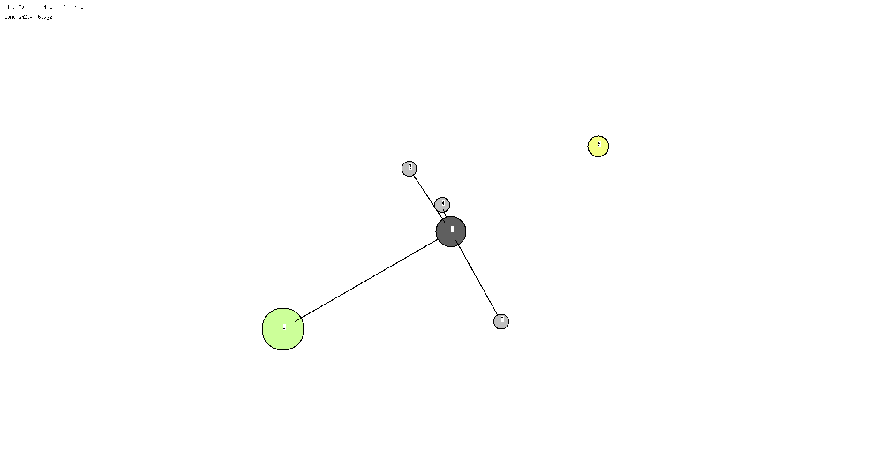
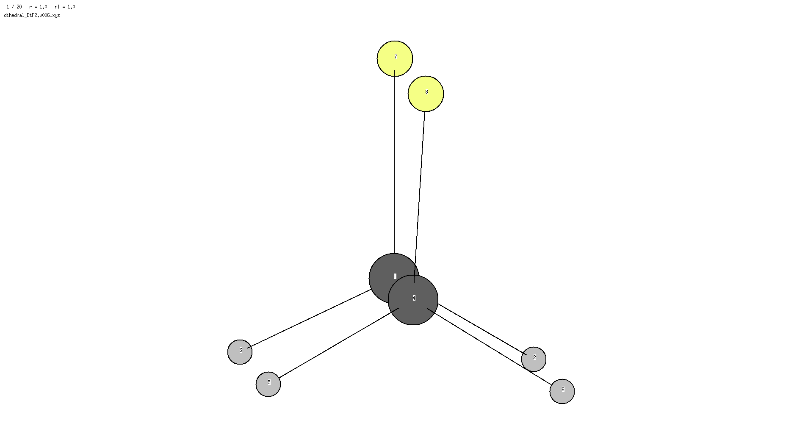
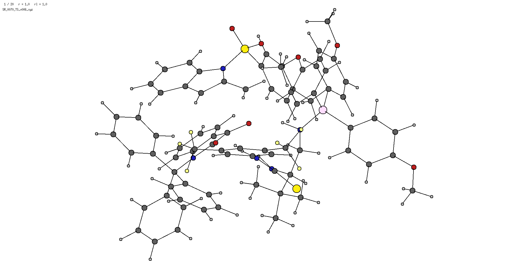
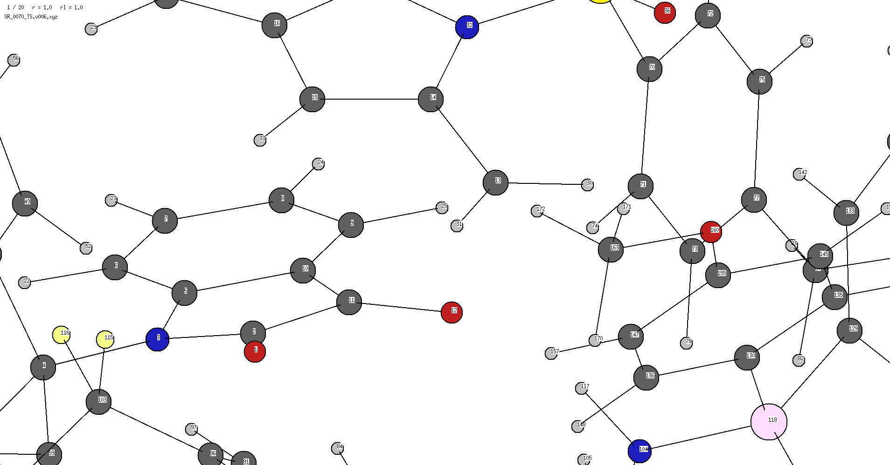

# graphRC: Internal Coordinate Analysis of Vibrational Modes

Identify bond formation/breaking, angle changes, and dihedral rotations from vibrational trajectories with graph-based transformation analysis.

[](https://pepy.tech/projects/vib-analysis) 
[](https://pepy.tech/projects/graphrc)
[](https://github.com/aligfellow/graphrc/blob/main/LICENSE)
[](https://docs.astral.sh/uv)
[](https://github.com/astral-sh/ruff)
[](https://github.com/astral-sh/ty)
[](https://github.com/aligfellow/graphrc/actions)
[](https://codecov.io/gh/aligfellow/graphrc)

> [!NOTE]
> :memo: A.S. Goodfellow* and B.N. Nguyen, _ChemRxiv_, 2025, DOI: [10.26434/chemrxiv-2025-k69gt](https://www.doi.org/10.26434/chemrxiv-2025-k69gt).  
> :newspaper: A.S. Goodfellow* and B.N. Nguyen, _J. Chem. Theory Comput._, 2026, DOI: [10.1021/acs.jctc.5c02073](https://www.doi.org/10.1021/acs.jctc.5c02073).  

---

## Table of Contents

- [Features](#features)
- [Installation](#installation)
- [Quick Start](#quick-start)
- [How It Works](#how-it-works)
- [Examples](#examples)
- [Command Line Interface](#command-line-interface)
- [Python API](#python-api)
- [Advanced Options](#advanced-options)
- [Important Notes](#important-notes)

---

## Features

### Core Analysis
✅ **Automatic trajectory extraction** from XYZ files or QM output (ORCA, Gaussian via cclib)  
✅ **Internal coordinate tracking** - identifies significant bond, angle, and dihedral changes  
✅ **Smart filtering** - separates primary changes from coupled secondary effects  

### Advanced Analysis (--graph flag)
🔍 **Mode characterization** - identifies rotations, inversions, aromatic systems  
🔍 **Bond formation/cleavage detection**  
🔍 **Bond order changes** (single ↔ double ↔ triple)  
🔍 **Formal charge redistribution** tracking  
🔍 **ASCII molecular visualization** of transformations

>[!IMPORTANT]
> Bond orders and formal charges are **empirically assigned** by [xyzgraph](https://github.com/aligfellow/xyzgraph) and should be treated as **indicative only**.   
> They are particularly unreliable for metal-containing systems. Use them as qualitative guides, not quantitative predictions.  

---

## Installation

### From pypi
```bash
pip install graphrc

# With optional dependencies for running threshold tuning plot
pip install graphrc[examples]
```

### From Source (*up-to-date*)
```bash
git clone https://github.com/aligfellow/graphRC.git
cd graphRC
pip install .
# or simply
pip install git+https://github.com/aligfellow/graphRC.git
```

### Dependencies
**Required:**
- `numpy` - Numerical operations
- `networkx` - Graph operations
- `xyzgraph` - Molecular graph construction (does the graph analysis)
- `cclib` - Parsing Gaussian/ORCA output

**Optional:**
- `matplotlib` and `seaborn` - Plotting for example scripts (`pip install graphrc[examples]`)

---

## Quick Start

```bash
# Simple bond analysis
graphrc trajectory.xyz

# With analysis (characterization + graph + ASCII visualization)
graphrc calculation.out --graph

# Save structures for IRC calculations
graphrc calculation.out --save-displacement

# Save with larger displacement (values >4 extrapolate beyond the trajectory using the normal mode vector)
graphrc calculation.out --save-displacement -ds 8
```

---

## How It Works

### Key Components

**Core Analysis:**
- Selects relevant frames for comparison
- Identifies which bonds/angles/dihedrals change
- Detects coupled proton transfers with reduced threshold for H movements
- Compares graphs to detect transformations
- Filters and classifies changes

**xyzgraph's Role:**
- Constructs molecular graphs from 3D coordinates
- Assigns bond orders using empirical rules
- Calculates formal charges using valence rules
- Provides the graph infrastructure that we use

---

## Examples

> **Note:** All atom indices are **zero-indexed**

### Example 1: SN2 Reaction


    - visualisation using [v.2.0](https://github.com/briling/v) by [**Ksenia Briling @briling**](https://github.com/briling):  
    - `v sn2.v000.xyz` press `f` and then `q` ; then ```bash convert -delay 5 -loop 0 sn2*xpm sn2.gif```

```bash
graphrc examples/data/sn2.v000.xyz
```

**Output:**
```
================================================================================
                                GRAPHRC
            Internal Coordinate Analysis of Vibrational Modes
                          A. S. Goodfellow, 2025
================================================================================

Reading trajectory from sn2.v000.xyz
Loaded 20 frames from trajectory
Using TS frame: 0
Selected diverse frames for analysis: [5, 14]

=========================== Significant Bond Changes ===========================
Bond (0, 4)  [C-F]   Δ =   1.584 Å,  Initial =   1.717 Å
Bond (0, 5)  [C-Cl]  Δ =   1.355 Å,  Initial =   1.952 Å
================================================================================
```

**Interpretation:** Classic SN2 mechanism - concerted C-F bond breaking and C-Cl bond forming.

---

### Example 2: Dihedral Rotation



```bash
graphrc examples/data/dihedral.v000.xyz -g
```

**Output (truncated):**
```
================================================================================
                         MODE CHARACTERIZATION
================================================================================

Mode Type: ROTATION
Description: Single bond rotation

1 dihedral rotation(s) detected:
  (6, 0, 3, 7): Single bond C-C rotation (43.8°)

================================================================================
                    VIBRATIONAL TRAJECTORY ANALYSIS
================================================================================

========================= Significant Dihedral Changes =========================
Dihedral (6, 0, 3, 7)  [F-C-C-F]  Δ =  43.778 °,  Initial =   0.002 °
================================================================================
```

**Interpretation:** Internal rotation about C-C bond causing F-C-C-F dihedral change of ~44°.

---

### Example 3: Complex Rearrangement (Basic Analysis)



```bash
graphrc examples/data/bimp.v000.xyz
```

**Output:**
```
================================================================================
                                  GRAPHRC
            Internal Coordinate Analysis of Vibrational Modes
                          A. S. Goodfellow, 2025
================================================================================

Reading trajectory from bimp.v000.xyz
Loaded 20 frames from trajectory
Using TS frame: 0
Selected diverse frames for analysis: [5, 15]

================================================================================
                    VIBRATIONAL TRAJECTORY ANALYSIS
================================================================================

=========================== Significant Bond Changes ===========================
Bond (11, 12)  [O-C]  Δ =   2.052 Å,  Initial =   2.064 Å
Bond (10, 14)  [C-C]  Δ =   0.426 Å,  Initial =   2.656 Å
================================================================================
```

**Interpretation:** Two significant bond changes detected - O-C formation and C-C breaking (formal \[2,3]-rearrangement).

---

### Example 4: With Graph Analysis & Charge Redistribution



```bash
graphrc examples/data/bimp.out -g
```

**Output (excerpt):**
```
graphrc examples/data/bimp.out -g -as 2
================================================================================
                                  GRAPHRC
            Internal Coordinate Analysis of Vibrational Modes
                          A. S. Goodfellow, 2025
================================================================================

Analyzed Mode 0: -333.88 cm⁻¹ (imaginary)

First 5 non-zero vibrational frequencies:
  Mode 0: -333.88 cm⁻¹ (imaginary)
  Mode 1: 8.57 cm⁻¹
  Mode 2: 12.72 cm⁻¹
  Mode 3: 13.27 cm⁻¹
  Mode 4: 15.83 cm⁻¹

================================================================================
ASCII REPRESENTATIONS
================================================================================

Transition State (TS):

           C
           |
           |
            |
            |     ------O
C-----------C-----       **
            *              *
            *               **
           *                 /C
           *                /
          -C==           ///
      ---- =========    /
  ----        ========C/
C-                  ===

Frame 1:

           C
           |
           |
            |
            |     ------O
C-----------C-----
            |
            |
           |                 /C
           |                /
          -C--           ///
      ----    ------    /
  ----              --C/
C-

Frame 2:

           C
           |
           |
            |
            |     ------O
C-----------C-----       \\
                           \
                            \\
                             /C
                            /
          -C==           ///
      ---- =========    /
  ----        ========C/
C-                  ===

================================================================================
                         MODE CHARACTERIZATION
================================================================================

Mode Type: BOND_CHANGE
Description: Bond formation/breaking

================================================================================
                    VIBRATIONAL TRAJECTORY ANALYSIS
================================================================================

=========================== Significant Bond Changes ===========================
Bond (11, 12)  [O-C]  Δ =   2.052 Å,  Initial =   2.064 Å
Bond (10, 14)  [C-C]  Δ =   0.426 Å,  Initial =   2.656 Å
================================================================================
```

**Interpretation:** Graph analysis reveals a rearrangement with bond formation/breaking, bond order changes, and charge redistribution. 

---

### Example 5: Showing All Changes (Including Minor)

```bash
graphrc examples/data/bimp.v000.xyz --all
```

Shows additional "Minor Angle Changes" and "Minor Dihedral Changes" sections with coupled secondary effects.

---

### Example 6: Larger SN2 System


```bash
graphrc examples/data/sn2_large.v000.xyz
```

**Output:**
```
================================================================================
                                GRAPHRC
            Internal Coordinate Analysis of Vibrational Modes
                          A. S. Goodfellow, 2025
================================================================================

Reading trajectory from sn2_large.v000.xyz
Loaded 20 frames from trajectory
Using TS frame: 0
Selected diverse frames for analysis: [5, 15]

================================================================================
                    VIBRATIONAL TRAJECTORY ANALYSIS
================================================================================

=========================== Significant Bond Changes ===========================
Bond (0, 21)  [C-N]  Δ =   2.388 Å,  Initial =   2.158 Å
Bond (0, 1)   [C-I]  Δ =   1.878 Å,  Initial =   2.563 Å
================================================================================
```

**Interpretation:** SN2 reaction in larger molecular context - C-I bond breaking and C-N bond forming.

---

### Example 7: Mn Catalyst Hydrogenation


```bash
graphrc examples/data/mn-h2.log --all
```

**Output:**
```
================================================================================
                                GRAPHRC
            Internal Coordinate Analysis of Vibrational Modes
                          A. S. Goodfellow, 2025
================================================================================

Reading trajectory from mn-h2.log
Loaded 20 frames from trajectory
Using TS frame: 0
Selected diverse frames for analysis: [5, 15]

Analyzed Mode 0: -748.48 cm⁻¹ (imaginary)

First 5 non-zero vibrational frequencies:
  Mode 0: -748.48 cm⁻¹ (imaginary)
  Mode 1: 20.26 cm⁻¹
  Mode 2: 25.12 cm⁻¹
  Mode 3: 32.45 cm⁻¹
  Mode 4: 36.68 cm⁻¹

================================================================================
                    VIBRATIONAL TRAJECTORY ANALYSIS
================================================================================

=========================== Significant Bond Changes ===========================
Bond (5, 65)   [N-H]   Δ =   1.776 Å,  Initial =   1.319 Å
Bond (65, 66)  [H-O]   Δ =   1.665 Å,  Initial =   1.203 Å
Bond (64, 66)  [H-O]   Δ =   0.920 Å,  Initial =   1.711 Å
Bond (1, 64)   [Mn-H]  Δ =   0.649 Å,  Initial =   1.898 Å
Bond (63, 64)  [H-H]   Δ =   0.244 Å,  Initial =   0.859 Å

============================= Minor Angle Changes ==============================
Angle (5, 1, 63)   [N-Mn-H]  Δ =  16.471 °,  Initial =  96.799 °
Angle (61, 1, 63)  [C-Mn-H]  Δ =  15.528 °,  Initial =  81.202 °
Angle (2, 1, 63)   [P-Mn-H]  Δ =  13.032 °,  Initial = 171.266 °

Note: These angles depend on other changes and may not be significant alone.

============================ Minor Dihedral Changes ============================
Dihedral (63, 1, 2, 36)  [H-Mn-P-C]  Δ =  81.780 °,  Initial =  76.752 °

Note: These dihedrals depend on other changes and may not be significant alone.
================================================================================
```

**Interpretation:** Hydrogenation mechanism involving multiple N-H, H-O, and Mn-H bond changes. Note the handling of metal-ligand interactions and the lower magnitude H-H bond detection due to a secondary H threshold.

---

## Command Line Interface

### Basic Usage

```bash
graphrc <input_file> [options]
```

### Options
```text
> graphrc -h

usage: graphrc [-h] [--version] [--cite] [--mode MODE] [--ts-frame TS_FRAME] [--frame-selection {rmsd,bookend}] [--relaxed] [--bond-tolerance BOND_TOLERANCE]
               [--bond-threshold BOND_THRESHOLD] [--angle-threshold ANGLE_THRESHOLD] [--dihedral-threshold DIHEDRAL_THRESHOLD] [--coupled-motion-filter COUPLED_MOTION_FILTER]
               [--coupled-proton-threshold COUPLED_PROTON_THRESHOLD] [--all] [--graph] [--method {cheminf,xtb}] [--charge CHARGE] [--multiplicity MULTIPLICITY]
               [--distance-tolerance DISTANCE_TOLERANCE] [--independent-graphs] [--ig-flexible] [--ascii-scale ASCII_SCALE] [--show-h] [--ascii-shells ASCII_SHELLS]
               [--save-displacement] [--displacement-scale DISPLACEMENT_SCALE] [--no-save] [--orca-path ORCA_PATH] [--debug]
               [input]

Internal Coordinate Analysis of Vibrational Modes.

positional arguments:
  input                 Input file (XYZ trajectory or QM output)

options:
  -h, --help            show this help message and exit
  --version             Show version information and exit
  --cite                Show citation information and exit
  --mode MODE, -m MODE  Vibrational mode to analyze (default: 0, ignored for XYZ)
  --ts-frame TS_FRAME   Frame index to use as TS reference (default: 0)
  --frame-selection {rmsd,bookend}, -fs {rmsd,bookend}
                        Frame selection method: rmsd (maximally diverse) or bookend (first and last) (default: rmsd)
  --debug, -d           Enable debug output

vibrational analysis parameters:
  --relaxed, -r         Use more relaxed rules for xyzgraph bond detection (may result in spurious bonds)
  --bond-tolerance BOND_TOLERANCE
                        Bond detection tolerance factor (default: 1.4)
  --bond-threshold BOND_THRESHOLD
                        Threshold for significant bond changes in Å (default: 0.4)
  --angle-threshold ANGLE_THRESHOLD
                        Threshold for significant angle changes in degrees (default: 10.0)
  --dihedral-threshold DIHEDRAL_THRESHOLD
                        Threshold for significant dihedral changes in degrees (default: 20.0)
  --coupled-motion-filter COUPLED_MOTION_FILTER
                        Coupled motion filter for filtering coupled changes in Å (default: 0.2, advanced)
  --coupled-proton-threshold COUPLED_PROTON_THRESHOLD
                        Reduced threshold for coupled proton transfers in Å (default: 0.15, use "false" to disable)
  --all, -a             Report all changes including minor ones

graph analysis parameters:
  --graph, -g           Enable graph-based analysis and mode characterization (rotations, inversions, aromatic systems)
  --method {cheminf,xtb}
                        Graph building method (default: cheminf)
  --charge CHARGE       Molecular charge for graph building (default: 0)
  --multiplicity MULTIPLICITY
                        Spin multiplicity (auto-detected if not specified)
  --distance-tolerance DISTANCE_TOLERANCE
                        Tolerance for bond formation/breaking (default: 0.2 Å)
  --independent-graphs, -ig
                        Build molecular graphs from the displaced geometries rather than TS geometry with guided bonding (more rigorous for use
                        with IRC or QRC displaced trajectories)
  --ig-flexible, -igf   Apply bond-tolerance to displaced graphs (with -ig). Default: displaced graphs use stricter xyzgraph defaults for more
                        rigorous connectivity detection

ASCII rendering options:
  --ascii-scale ASCII_SCALE, -as ASCII_SCALE
                        Scale for ASCII molecular rendering (default: 2.5)
  --show-h              Show hydrogen atoms in ASCII rendering
  --ascii-shells ASCII_SHELLS, -ash ASCII_SHELLS
                        Neighbor shells around transformation core (default: 1)

output options:
  --save-displacement, -sd
                        Save displaced structure pair
  --displacement-scale DISPLACEMENT_SCALE, -ds DISPLACEMENT_SCALE
                        Displacement scale for saved displaced structures (1-4 uses trajectory frames directly, ~0.2-0.8
                        amplitude; >4 extrapolates beyond the trajectory using the normal mode vector) (default: 1)
  --no-save             Do not save trajectory to disk (keep in memory only)
```


### Threshold Tuning

```bash
# Adjust bond detection sensitivity
graphrc input.xyz --bond-threshold 0.3

# Adjust angle detection
graphrc input.xyz --angle-threshold 15.0
```

### Graph Analysis Options

```bash
# With ASCII visualization
graphrc input.xyz -g --ascii-scale 2.5 --show-h

# Adjust display around reactive center
graphrc input.xyz -g --ascii-shells 2

# Set molecular charge
graphrc input.xyz -g --charge -1

# Use independent graph building (more rigorous for IRC/QRC trajectories)
graphrc input.xyz -g --independent-graphs
```

### Independent Graph Building

By default, molecular graphs are built from TS geometry with bonding guided by the bond changes across the trajectory. The `--independent-graphs` (`-ig`) flag enables connectivity augmentation where displaced structure graphs are built independently and merged with TS connectivity:

```bash
# Standard approach (TS-centric, default, uses maximally diverse rmsd frames and ts_frame=0)
graphrc irc_trajectory.xyz -g

# Independent approach (builds from actual geometries)
graphrc irc_trajectory.xyz -g --independent-graphs

# Independent approach (builds from actual geometries, with bookend frames and TS frame)
graphrc irc_trajectory.xyz -g --independent-graphs --frame-selection bookend --ts-frame 5

# Independent approach with flexible displaced connectivity
graphrc irc_trajectory.xyz -g --independent-graphs --ig-flexible
```

**How it works:**
- **TS connectivity**: Built with `bond_tolerance` (flexible, captures forming/breaking bonds)
- **Displaced connectivity**: Built with xyzgraph defaults  or `bond_tolerance` (if `--ig-flexible`)
- **Merged connectivity**: Union of TS and displaced graphs
- **Result**: All connectivity tracked, including bonds that only appear in displaced frames

**When to use `--independent-graphs`:**
- Analyzing IRC or QRC trajectories with actual minima geometries
- Ensuring no connectivity is missed due to TS geometry bias
- Validating that all relevant bonds are tracked across the trajectory
- Formal validation of connectivity changes

**When to use `--ig-flexible`:**
- When displaced endpoints have stretched bonds that should still be tracked
- When you want maximum connectivity captured
- Generally *unnecessary*

**Differences:**
- **Default (TS-centric)**: Internal coordinates from TS geometry only
- **Independent (`-ig`)**: Augments TS with bonds from displaced geometries (strict thresholds)
- **Independent + Flexible (`-ig -igf`)**: Augments TS with bonds from displaced geometries (flexible thresholds)

### Output Control

```bash
# Save displaced structures
graphrc input.xyz --save-displacement --displacement-scale 2
# or
graphrc input.xyz -sd -ds 2


# Don't save trajectory to disk
graphrc input.xyz --no-save
```

### Complete Example

```bash
graphrc bimp.out \
  --mode 0 \
  --graph \
  --debug \
  --save-displacement \
  --ascii-shells 1 \
  --ascii-scale 2.5
```

---

## Python API

See examples/examples.ipynb
This function will return a dictionary of the results, and printing can be turned on to produce the same as the CLI
For example:
```python
from graphrc import run_vib_analysis

xyz_trj = 'data/bimp.v000.xyz'
# Basic analysis
results = run_vib_analysis(
        input_file=xyz_trj,
    )

vib = results['vibrational']
print(vib)

theoretical_bond_changes = [(11,12), (10,14)]
if all(bond in vib['bond_changes'] for bond in theoretical_bond_changes):
    print(f'True: All theoretical bond changes {theoretical_bond_changes} found in results.')

# With graph analysis and independent graphs (for IRC/QRC trajectories)
results_ig = run_vib_analysis(
        input_file='irc_trajectory.xyz',
        enable_graph=True,
        independent_graphs=True,  # Build from actual geometries
        print_output=True
    )
```
Outputs:
```python
{'bond_changes': {(10, 14): (0.426, 2.656), (11, 12): (2.052, 2.064)}, 'angle_changes': {}, 'minor_angle_changes': {(13, 12, 29): (14.436, 122.116), (29, 12, 30): (12.54, 117.79), (12, 13, 14): (14.118, 123.702)}, 'dihedral_changes': {}, 'minor_dihedral_changes': {(0, 1, 10, 11): (36.48, -14.986), (4, 9, 10, 11): (50.966, -169.776), (29, 12, 13, 31): (67.358, -17.521), (12, 13, 31, 33): (62.151, 29.631)}, 'frame_indices': [5, 15], 'atom_index_map': {0: 'O', 1: 'C', ...}}
True: All theoretical bond changes [(11, 12), (10, 14)] found in results.
```
  - This can be used to check for a known vibrational mode (theoretical_bond_change) in `results['bond_changes']`
  - So in theory this could identify whether the correct TS mode has been identidied in a high throughput search if the atom indices are known (or available automatically)


### Results Structure

```python
{   'metadata': {
      'version': float, 
      'citation': str, 
      'input_file': str, 
      'xyzgraph_version': float, 
      'xyzgraph_citation': str, 
      'parameters': Dict
    }, 
    'trajectory': {
        'frames': List[Dict],        # List of frame dictionaries
        'frequencies': List[float],  # cm⁻¹ (None for XYZ)
        'trajectory_file': str       # Path to saved file
    },
    'vibrational': {
        'bond_changes': Dict[Tuple, Tuple[float, float]],
        'angle_changes': Dict[Tuple, Tuple[float, float]],
        'dihedral_changes': Dict[Tuple, Tuple[float, float]],
        'minor_angle_changes': Dict,
        'minor_dihedral_changes': Dict,
        'frame_indices': List[int],
        'atom_index_map': Dict[int, str]
    },
    'graph': {                       # Only if enable_graph=True
        'comparison': Dict,
        'ts_graph': nx.Graph,        # graph objects can be 
        'frame1_graph': nx.Graph,    #    extracted if desired
        'frame2_graph': nx.Graph,
        'ascii_ts': str,
        'ascii_ref': str,
        'ascii_disp': str
    },
    'displacement_files': Tuple[str, str]  # If save_displacement=True
}
```

---

## Advanced Options

### Configuration Parameters

All defaults are in `config.py` and can be overridden:

**Detection Tolerances:**
```python
BOND_TOLERANCE = 1.4        # vdW radii multiplier for TS
```

**Significance Thresholds:**
```python
BOND_THRESHOLD = 0.4        # Minimum Δ (Å) 
ANGLE_THRESHOLD = 10.0      # Minimum Δ (degrees)
DIHEDRAL_THRESHOLD = 20.0   # Minimum Δ (degrees)
COUPLED_MOTION_FILTER = 0.2 # For secondary filtering of coupled changes
COUPLED_PROTON_THRESHOLD = 0.15 # Low threshold for coupled H movements (Å) 
```

**Graph Analysis:**
```python
DISTANCE_TOLERANCE = 0.2    # Bond formation/breaking (Å)
ASCII_SCALE = 2.5           # Rendering scale
ASCII_NEIGHBOR_SHELLS = 1   # Expansion around reactive center
```

### Coupled Proton Transfer Detection

For systems involving proton transfers or H₂ coordination, a reduced threshold can detect coupled H movements that fall below the standard bond threshold allowing for chemically relevant but asynchronous bond changes:

**How it works:**
- When an H atom is involved in a detected bond change, all other bonds involving that H are checked with the reduced threshold (0.15 Å instead of 0.4 Å)

**CLI Usage:**
```bash
# Custom threshold (enabled by default)
graphrc input.xyz --coupled-proton-threshold 0.20

# Disable feature
graphrc input.xyz --coupled-proton-threshold false
```

**Python API:**
```python
# Custom threshold
results = run_vib_analysis('input.xyz', coupled_proton_threshold=0.20)

# Disabled
results = run_vib_analysis('input.xyz', coupled_proton_threshold=False)
```

### Displaced Structure Export

Generate structures for tight optimization to either side of the TS:

```bash
# Default: ±1 amplitude (~0.2)
graphrc input.xyz --save-displacement

# Higher amplitude: ±2 (~0.4)
graphrc input.xyz --save-displacement --displacement-scale 2

# Creates: input_F.xyz (forward), input_R.xyz (reverse)
```

Displacement scale 1-4 correspond to amplitudes of ~0.2, 0.4, 0.6, 0.8. The direction is arbitrary.  

### Custom Frame Selection

```bash
# Override TS frame
graphrc input.xyz --ts-frame 5
```

By default, frame 1 is the TS, and frames with maximum RMSD are selected automatically.

---

### Threshold Validation

The default bond displacement threshold (0.4 Å) has been validated against a diverse set of 15 transition state systems. "Ground truth" bond changes were determined from IRC calculations (`examples/data/expected_results.py`).

**Validation script:**
```bash
python examples/threshold_tuning.py
```

**Results:** The default threshold of 0.4 Å combined with coupled proton detection provides optimal performance:
- **100%** F1 % score (balance of precision and recall, reported as a %)
- **100%** detection rate % (all expected bonds found)
- **0%** false positive rate %
- **full accuracy of *all* vibrational bonds across *all* 16 transition states**  


Detailed validation results are written to `examples/threshold_optimization.txt` for full transparency.

---

## Important Notes

**Integrated threshold adjustments**
- Thresholds are reduced by 50% if there is no initial detection of interal coordinate changes
- This is flagged in the output and these may be less reliable
- Allows for the detection of changed coordinated in very low magnitude modes (*i.e.* hindered aryl rotation)

**Use as indicators only!** Always cross-validate with:
- IRC
- Optimisations of displaced structures
- Your own chemical insight

### File Formats

**Supported Inputs:**
- XYZ trajectory (`.xyz`) - direct read
- ORCA output (`.out`) - parsed directly from output file
- Gaussian (`.log`) - via cclib

**XYZ Format:**
```
<n_atoms>
Comment line
<symbol> <x> <y> <z>
...
```

Must contain ≥2 frames.

---

## Acknowledgments

- Uses [xyzgraph](https://github.com/aligfellow/xyzgraph) for graph construction and ascii printing
- QM output parsing via [cclib](https://github.com/cclib/cclib)
- Visualization examples with [v.2.0](https://github.com/briling/v) by Ksenia Briling

---

## Developer Setup

To develop with `graphRC`, you can clone the repo and use
[`just`](https://github.com/casey/just) and [`uv`](https://docs.astral.sh) to setup the dev environment:

```bash
just setup
```
The cli can be used with:
```bash
uv run graphrc filename.out
```

Run the checks using:
```bash
just check
```
