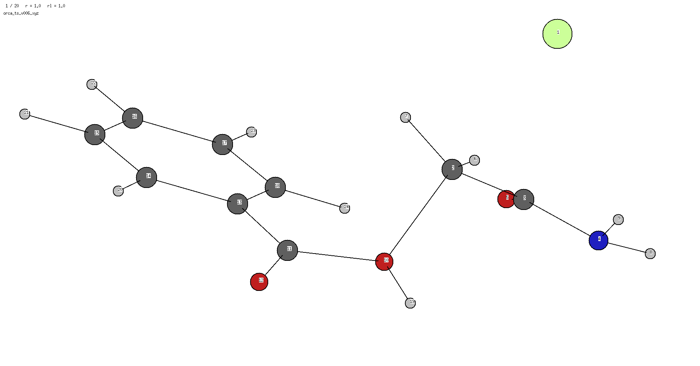
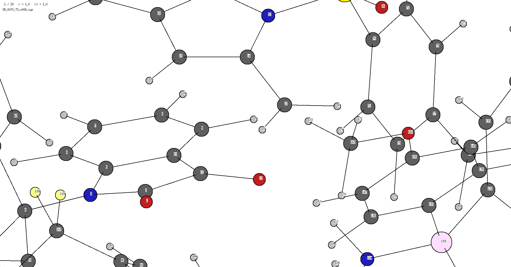
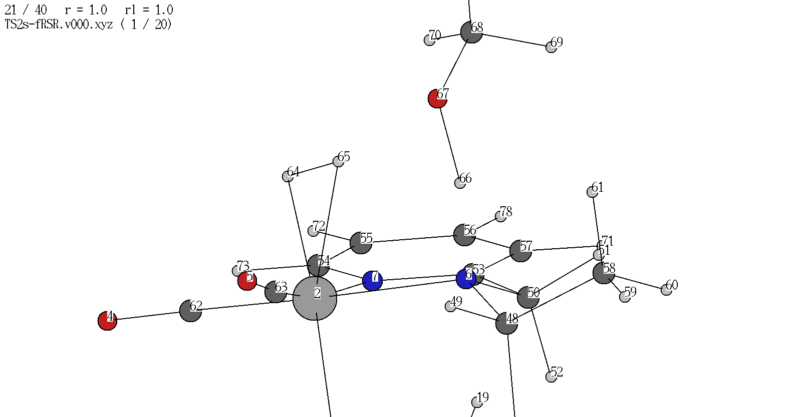

# A command line and python package to read frequency calculation outputs or vibrational trajectories and return the internal coordinates associated with the vibration. *i.e.* a fast TS mode identification

## Installation
For now can be installed locally by:
```
git clone https://github.com/aligfellow/vib_analysis.git
cd vib_analysis
pip install .
```

## Usage
- Requires a `*trj.xyz` file
  - of the structure:
```
[n_atoms]
comment line
<atomic symbol/number> <x> <y> <z>
... ... ... ... 
```
- Currently, this has been written for orca.out
  - orca and gaussian can be parsed (using cclib) **0 indexed modes**
  - orca can also be parsed separately with wrapper around orca_pltvib `--parse_orca --mode 6`
     - orca includes zero modes *i.e.* 3N-5 and 3N-6, so non-linear should use `--mode 6` for the first mode
     - this is currently to avoid problems parsing orca_6.1.0
  - **atom indices are zero indexed** (though the viewer used below is *one indexed*)
     
## IN PROGRESS
To Do:
 - ~gaussian output parsing with cclib~
 - ~orca output parsing with cclib and orca_pltvib~
 - improve/check the python interface and usage in the .ipynb examples

Later:
 - atom symbol printing in the output

## Command line interface
```
> vib_analysis -h
usage: vib_analysis [-h] [--parse_cclib] [--parse_orca] [--mode MODE] [--bond_tolerance BOND_TOLERANCE]
                    [--angle_tolerance ANGLE_TOLERANCE] [--dihedral_tolerance DIHEDRAL_TOLERANCE] [--bond_threshold BOND_THRESHOLD]
                    [--angle_threshold ANGLE_THRESHOLD] [--dihedral_threshold DIHEDRAL_THRESHOLD] [--ts_frame] [--all]
                    input

Vibrational Mode Analysis Tool

positional arguments:
  input                 Input file (XYZ trajectory, ORCA output, or Gaussian log)

options:
  -h, --help            show this help message and exit
  --parse_cclib         Process Gaussian/ORCA/other output file instead of XYZ trajectory: requires --mode !0 indexed!
  --parse_orca          Parse ORCA output file instead of XYZ trajectory: requires --mode !orca indexed! - ie 6 for first mode (3N-6)
  --mode MODE           Mode index to analyze (for Gaussian/ORCA conversion)
  --bond_tolerance BOND_TOLERANCE
                        Bond detection tolerance multiplier. Default: 1.5
  --angle_tolerance ANGLE_TOLERANCE
                        Angle detection tolerance multiplier. Default: 1.1
  --dihedral_tolerance DIHEDRAL_TOLERANCE
                        Dihedral detection tolerance multiplier. Default: 1.0
  --bond_threshold BOND_THRESHOLD
                        Minimum internal coordinate change to report. Default: 0.5
  --angle_threshold ANGLE_THRESHOLD
                        Minimum angle change in degrees to report. Default: 10
  --dihedral_threshold DIHEDRAL_THRESHOLD
                        Minimum dihedral change in degrees to report. Default: 20
  --ts_frame            TS frame for distances and angles in the TS. Default: 0 (first frame)
  --all                 Report all changes in angles and dihedrals.
```                 
Python interface similarly:
  - see example in examples .ipynb

## Minimal Examples 
Sample python use in examples/ folder:

    - visualisation using [v.2.0](https://github.com/briling/v) by [**Ksenia Briling @briling**](https://github.com/briling) 
    - ```v sn2.v006.xyz``` press `f` and then `q` ; then ```convert -delay 5 -loop 0 sn2*xpm sn2.gif```

From the command line:
``` 
> vib_analysis sn2.v006.xyz
 # OR
> vib_analysis sn2.out --parse_orca --mode 6

Analysed vibrational trajectory from sn2.v006.xyz:

===== Significant Bond Changes =====
Bond (0, 4): Δ = 1.584 Å, Initial Length = 1.717 Å
Bond (0, 5): Δ = 1.356 Å, Initial Length = 1.952 Å
```
The magnitude and change (Δ) of the modes is somewhat meaningless, though this should report the initial value of the 1st frame (or reference frame).

Another example:

```
> vib_analysis dihedral.v006.xyz
# OR
> vib_analysis dihedral.out --parse_orca --mode 6

Analysed vibrational trajectory from dihedral.v006.xyz:

===== Significant Dihedral Changes =====
Dihedral (6, 0, 3, 7): Δ = 39.556 degrees, Initial Value = 359.998 degrees
```

The bond changes are hierarchical, so an angle with a large change as a consequence of a bonding change is not reported as a *significant* change.

Another:

```
> vib_analysis large_sn2.v006.xyz

Analysed vibrational trajectory from large_sn2.v006.xyz:

===== Significant Bond Changes =====
Bond (1, 9): Δ = 1.512 Å, Initial Length = 1.668 Å
Bond (0, 1): Δ = 1.333 Å, Initial Length = 2.498 Å

===== Significant Angle Changes =====
Angle (11, 10, 12): Δ = 12.078 degrees, Initial Value = 129.135 degrees
```

## More detailed information
- the `--all` flag turns on reporting of coupled internal coordinate changes, including:
   - Default output:
  ```
  ===== Significant Bond Changes =====
  ===== Significant Angle Changes =====
  ===== Significant Dihedral Changes =====
  ```
    - additional output - not necessarily insignificant changes in internal coordinates but strongly coupled
  ```
  ===== Minor Angle Changes =====
  ===== Less Significant Dihedral Changes =====   
  ```
  - *i.e.* where a bond is changed, the angles around it will be altered across a vibrational trajectory and those angles would be significant enough to report as a change
  - where one of these atoms is involved in a *significant* bond change, the angle is classed as minor due to the coupled nature of the internal coordinates
     - same applies for dihedrals

## Further Examples
Complex transformation with BIMP catalysed rearrangement

```
> vib_analysis bimp.v006.xyz --all #(including the flag to print all internal coordinate changes)

Analysed vibrational trajectory from bimp.v006.xyz:

===== Significant Bond Changes =====
Bond (11, 12): Δ = 1.432 Å, Initial Length = 2.064 Å

===== Significant Dihedral Changes =====
Dihedral (32, 14, 15, 20): Δ = 30.937 degrees, Initial Value = 350.826 degrees
Dihedral (31, 13, 14, 32): Δ = 29.557 degrees, Initial Value = 185.910 degrees

Note: These dihedrals are not directly dependent on other changes however they may be artefacts of other motion in the TS.

===== Minor Angle Changes =====
Angle (13, 12, 29): Δ = 11.020 degrees, Initial Value = 122.116 degrees

Note: These angles are dependent on other changes and may not be significant on their own.

===== Less Significant Dihedral Changes =====
Dihedral (29, 12, 13, 31): Δ = 48.971 degrees, Initial Value = 17.521 degrees
Dihedral (2, 1, 10, 11): Δ = 35.026 degrees, Initial Value = 194.336 degrees

Note: These dihedrals are dependent on other changes and may not be significant on their own.
```


- correctly identifies the bond change between atoms 11 and 12
   - misses the smaller magnitude bonding change of 10 and 14 (since it is below a threshold) *see below for adjustment*
- identifies extra dihedrals for now - atoms 13, 14, 15 featured as neighbours of the bonding change
- also picking up motion of the thiourea protons that have strong NCIs with the substrate
- this may have suffered from a poor internal coordinate construction?

```
> vib_analysis bimp.v006.xyz --bond_threshold=0.2

Analysed vibrational trajectory from bimp.v006.xyz:

===== Significant Bond Changes =====
Bond (11, 12): Δ = 1.432 Å, Initial Length = 2.064 Å
Bond (10, 11): Δ = 0.204 Å, Initial Length = 1.287 Å

===== Significant Dihedral Changes =====
Dihedral (32, 14, 15, 20): Δ = 30.937 degrees, Initial Value = 350.826 degrees
Dihedral (31, 13, 14, 32): Δ = 29.557 degrees, Initial Value = 185.910 degrees

Note: These dihedrals are not directly dependent on other changes however they may be artefacts of other motion in the TS.
```

Mn catalyst hydrogenation

```
> vib_analysis mn.log --parse_cclib --mode 0 --all
Written trajectory to: mn.v000.xyz

First 5 non-zero vibrational frequencies:
  Mode 0: -748.5 cm**-1  (imaginary)
  Mode 1: 20.3 cm**-1
  Mode 2: 25.1 cm**-1
  Mode 3: 32.5 cm**-1
  Mode 4: 36.7 cm**-1

Analysed vibrational trajectory (Mode 0 with frequency -748.483 cm**-1):

===== Significant Bond Changes =====
Bond (5, 65): Δ = 1.776 Å, Initial = 1.319 Å
Bond (65, 66): Δ = 1.665 Å, Initial = 1.203 Å
Bond (64, 66): Δ = 0.919 Å, Initial = 1.711 Å
Bond (1, 65): Δ = 0.875 Å, Initial = 2.591 Å
Bond (1, 64): Δ = 0.649 Å, Initial = 1.898 Å

===== Minor Angle Changes =====
Angle (5, 1, 63): Δ = 16.471°, Initial = 96.799°
Angle (61, 1, 63): Δ = 15.528°, Initial = 81.202°
Angle (2, 1, 63): Δ = 13.033°, Initial = 171.266°

Note: These angles are dependent on other changes and may not be significant on their own.

===== Less Significant Dihedral Changes =====
Dihedral (63, 1, 2, 36): Δ = 81.780°, Initial = 283.248°

Note: These dihedrals are dependent on other changes and may not be significant on their own.
```
- this correctly identifies bonding changes of this transition state
- parsing the output prints the imaginary modes from the output file
- gaussian parsing (with [cclib](https://github.com/cclib/cclib) takes a *zero indexed mode* `--mode 0`

Orca output parsing is also possible with `--parse_cclib` and separately with `--parse_orca` 
  - it appears that cclib cannot yet deal with orca_6.1.0 
```
> vib_analysis dihedral.out --parse_orca --mode 6

First 5 non-zero vibrational frequencies:
  Mode 6: -388.5 cm**-1  (imaginary)
  Mode 7: 276.9 cm**-1
  Mode 8: 634.5 cm**-1
  Mode 9: 738.1 cm**-1
  Mode 10: 940.0 cm**-1

Analysed vibrational trajectory (Mode 6 with frequency -388.51 cm**-1):

===== Significant Dihedral Changes =====
Dihedral (6, 0, 3, 7): Δ = 39.556°, Initial = 359.998°
```
- as above, but takes mode 6 as the first (which is how the modes are printed in the orca.out files as the zero modes are reported for translation and rotation

And again, with the bimp example:
```
vib_analysis bimp.out --parse_orca --mode 6 --bond_threshold 0.2 --all

First 5 non-zero vibrational frequencies:
  Mode 6: -333.9 cm**-1  (imaginary)
  Mode 7: 8.6 cm**-1
  Mode 8: 12.7 cm**-1
  Mode 9: 13.3 cm**-1
  Mode 10: 15.8 cm**-1

Analysed vibrational trajectory (Mode 6 with frequency -333.88 cm**-1):

===== Significant Bond Changes =====
Bond (11, 12): Δ = 1.432 Å, Initial = 2.064 Å
Bond (10, 11): Δ = 0.204 Å, Initial = 1.287 Å

===== Significant Dihedral Changes =====
Dihedral (32, 14, 15, 20): Δ = 30.937°, Initial = 350.826°
Dihedral (31, 13, 14, 32): Δ = 29.557°, Initial = 185.910°

Note: These dihedrals are not directly dependent on other changes however they may be artefacts of other motion in the TS.

===== Minor Angle Changes =====
Angle (13, 12, 29): Δ = 11.020°, Initial = 122.116°

Note: These angles are dependent on other changes and may not be significant on their own.

===== Less Significant Dihedral Changes =====
Dihedral (29, 12, 13, 31): Δ = 48.971°, Initial = 17.521°

Note: These dihedrals are dependent on other changes and may not be significant on their own.
```
- this *also works* using the command `vib_analysis bimp.out --parse_cclib --mode 0 --bond_threshold 0.2 --all`
  - this output used `orca_6.0.1`
